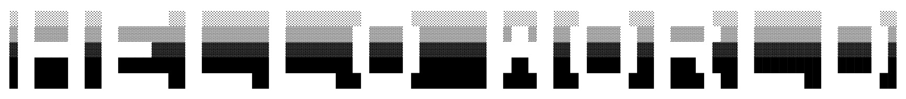

### About me

                               

Hello! I'm JJ. I have a strong passion for computer programming and am currently diving into the world of web development. My journey in the tech field is fueled by my curiosity and eagerness to learn, driving me to create engaging, user-friendly websites.

Outside of coding, I'm a big fan of console gaming. I love getting lost in the immersive stories and complex worlds that games provide. Balancing my time between the logical aspects of programming and the creative outlets of gaming, I'm on a path to building a diverse set of skills and interests.

##

### My skills

  &nbsp;
  &nbsp;
  &nbsp;

##

